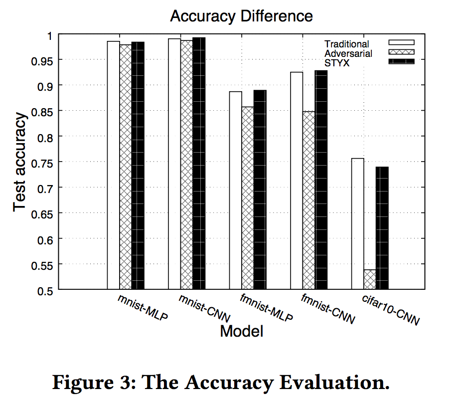
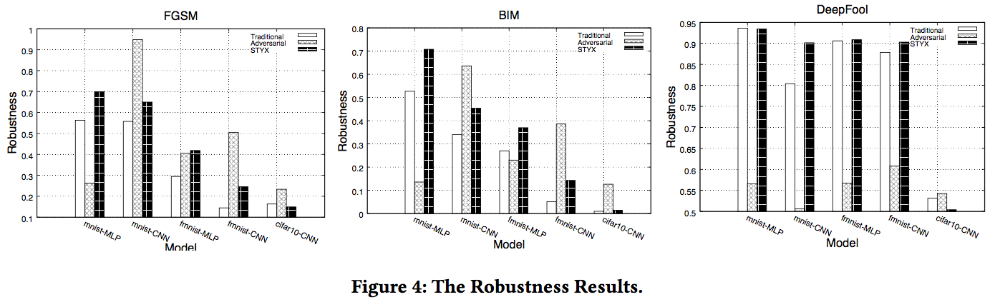
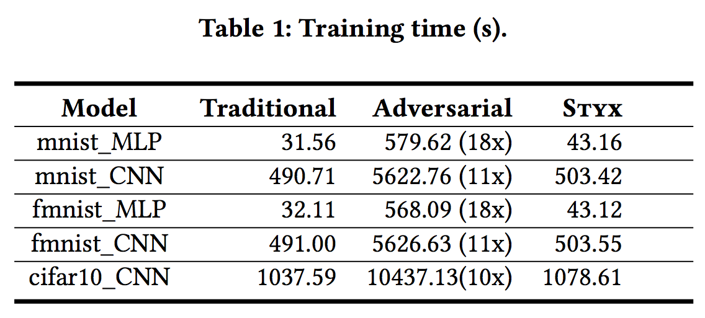

* * *
#  **Experimental Results**
* * * 

Here we presented the experimental results in the paper:

## ***1. Evaluation***
Our evaluation uses three benchmarks: MNIST, Fashion-MNIST and CIFAR-10. We use the standard model structures (the multilayer perceptron "MLP" and the convolutional neural network "CNN") provided in Keras for the benchmarks. The data\_ratio and pixel\_ratio are 0.5 and 0.1, respectively. The test accuracies of the well-trained models are 98.53% (mnist\_MLP), 99.03% (mnist\_CNN), 88.69% (fmnist\_MLP), 92.50% (fmnist\_CNN) and 75.62% (cifar10\_CNN), respectively. During evaluation, we use FGSM, BIM and DeepFool as the attacking methods.

## ***2. Effectiveness***

Figure 3 shows the test accuracy result of different training methods. The test accuracy under adversarial training decreases compared with the other two training methods. STYX has a similar test accuracy with that of the traditional training. 

Figure 4 shows the average robustness of these models under different attacking methods w.r.t. 10 different parameter configurations. For 15 comparisons (i.e., 3 attacks x 5 models), STYX performs best in 7/15 comparisons and improves the robustness by 8.8% (FGSM), 9.8% (BIM) and 1.9% (DeepFool) on average, respectively. These results indicate that STYX's effectiveness.

## ***3. Efficiency***

Table 1 shows the time-costs of different training methods. Compared with traditional training (second column), adversarial training (third column) often takes 10-18x time to train a model. In contrast, the time-cost of STYX is much cheaper and close to that of traditional training. These experimental results demonstrate that STYX is more efficient for training models than adversarial training.

